# MPI PageRank Implementation Guide

## 📋 Table of Contents
1. [What is This Code?](#what-is-this-code)
2. [How PageRank Works](#how-pagerank-works)
3. [Code Architecture](#code-architecture)
4. [Key Components Explained](#key-components-explained)
5. [Compilation & Execution](#compilation--execution)
6. [Performance Metrics](#performance-metrics)
7. [Common Issues](#common-issues)
8. [Quick Reference](#quick-reference)

---

## What is This Code?

**Think of it like this:** You have a web graph with millions of pages connected by links. You want to know which pages are most important. This code calculates **PageRank** scores for all pages in parallel using multiple computers/processors.

### In Simple Terms:
- **Input**: A graph (pages + links between them)
- **Process**: Calculate importance scores using parallel computing
- **Output**: Score for each page (higher = more important)

---

## How PageRank Works

### The Core Formula

$$PR(i) = d \cdot \sum_{j \in B_i} \frac{PR(j)}{L(j)} + \frac{1-d}{N}$$

**Breaking it down:**
- `PR(i)` = Importance of page i
- `PR(j)` = Importance of pages that link to i
- `OutLinks(j)` = How many links page j has
- `N` = Total number of pages
- `0.85` = Damping factor (85% chance of following links)
- `0.15/N` = Random jump factor (15% chance of jumping anywhere)

**Real World Analogy**: 
Imagine you're randomly clicking links on the web. The PageRank score represents the probability you'll end up on a specific page after many clicks.

### Convergence Criterion
```c
#define ERROR 1e-6  // Stop when changes are smaller than 0.000001
```

The algorithm stops when PageRank values stabilize (changes become very small).

## Code Architecture

### File Structure
```
project/
├── main.c                           # Main PageRank code (THIS FILE)
├── libraries/
│   ├── pagerank_utils2.h/.c        # Graph loading & management
│   └── measure.h/.c                # Performance measurement tools
├── dataset/
│   └── data0.dat                   # Your graph data
└── sequential/
    └── sequential_time.txt         # Single-core execution time
```

### High-Level Flow
<center>
    <figure>
        
        <figcaption>Figura 1: Flusso ad alto livello dell'implementazione PageRank con MPI</figcaption>
    </figure>
</center>

## Key Components Explained

### 1. **Graph Representation (CSR Format)**

**Why CSR?** Efficient memory usage - stores only non-zero elements.

```c
// CSR Structure (from pagerank_utils2.h)
typedef struct {
    int N;          // Number of nodes (pages)
    int E;          // Number of edges (links)
    int *row_ptr;   // Start index for each node's edges
    int *col_idx;   // Destination nodes
    double *val;    // Edge weights (normalized)
    int *outdeg;    // Number of outgoing links per node
} CSRGraph;
```

**Visual Example:**
```
Graph: 1->2, 1->3, 2->3
CSR Representation:
row_ptr = [0, 2, 3, 3]  // Node 0 has edges 0-1, Node 1 has edge 2, Node 2 has none
col_idx = [1, 2, 2]     // Edges to nodes: 1->2, 1->3, 2->3
val = [0.5, 0.5, 1.0]   // Normalized weights
```

### 2. **Load Balancing - The Smart Partitioning**

**Why it matters:** Work is distributed evenly so no single process is overloaded.

```c
// 🏷️ PARTITIONING STRATEGY (lines 120-135)
int *counts = malloc(size * sizeof(int));
int *displs = malloc(size * sizeof(int));

int rem = N % size;  // Remaining nodes after equal distribution

// Each process gets base = N/size nodes
for (int r = 0; r < size; r++) {
    counts[r] = N / size + (r < rem ? 1 : 0);  // First 'rem' processes get +1 node
}

// Calculate starting positions
displs[0] = 0;
for (int r = 1; r < size; r++) {
    displs[r] = displs[r - 1] + counts[r - 1];
}

// Each process's range
start = displs[rank];
end = start + counts[rank];
```

**Example with 100 nodes, 3 processes:**
- Process 0: nodes 0-33 (34 nodes)
- Process 1: nodes 34-66 (33 nodes)
- Process 2: nodes 67-99 (33 nodes)

### 3. **Main Computation Loop**

```c
// 🏷️ MAIN ITERATION (lines 148-195)
do {
    // Reset local contributions
    for (i = 0; i < N; i++)
        local[i] = 0.0;

    // Each process computes its part
    for (i = start; i < end; i++) {
        for (j = g.row_ptr[i]; j < g.row_ptr[i + 1]; j++) {
            local[g.col_idx[j]] += g.val[j] * pr[i];
        }
    }

    // Combine results from all processes
    MPI_Allreduce(local, global, N, MPI_DOUBLE, MPI_SUM, MPI_COMM_WORLD);

    // Update PageRank values
    for (i = 0; i < N; i++) {
        double newv = DAMPING * global[i] + (1.0 - DAMPING) / N;
        norm_local += (newv - pr[i]) * (newv - pr[i]);
        pr[i] = newv;
    }

    // Check convergence
    MPI_Allreduce(&norm_local, &norm, 1, MPI_DOUBLE, MPI_SUM, MPI_COMM_WORLD);
    norm = sqrt(norm);

} while (norm > ERROR);  // 🛑 Loop until convergence
```

**Step-by-step:**
1. Each process computes contributions from its assigned nodes
2. All processes share results (`MPI_Allreduce`)
3. Everyone updates their PageRank values
4. Calculate how much values changed
5. If changes are small enough → STOP

### 4. **PR Sum Validation**

```c
// 🏷️ VALIDATION CHECK (lines 197-208)
double local_pr_sum = 0.0;
double global_pr_sum = 0.0;

// Each process sums its PageRank values
for (i = start; i < end; i++) {
    local_pr_sum += pr[i];
}

// Combine to get total sum
MPI_Reduce(&local_pr_sum, &global_pr_sum, 1, MPI_DOUBLE, MPI_SUM, MASTER, MPI_COMM_WORLD);

// Should equal 1.0 (since PageRank is a probability distribution)
```

**Why check this?** 
- PageRank values represent probabilities
- Sum should always equal 1.0
- If not → numerical error or implementation bug

### 5. **Performance Measurement**

```c
// 🏷️ TIMING (lines 40-50, 215-250)
double setup_start = measure_get_time();    // Start timing
// ... do work ...
double setup_end = measure_get_time();      // End timing

double compute_start = measure_get_time();
// ... PageRank iterations ...
double compute_end = measure_get_time();

// Calculate speedup
double speedup = measure_speedup(seq_time, total_time);

// Calculate efficiency
double efficiency = measure_efficiency(speedup, size);
```

**What gets measured:**
- **Setup Time**: Loading graph, broadcasting
- **Compute Time**: PageRank iterations
- **Total Time**: Everything combined
- **Speedup**: Sequential time / Parallel time
- **Efficiency**: Speedup / Number of processes
